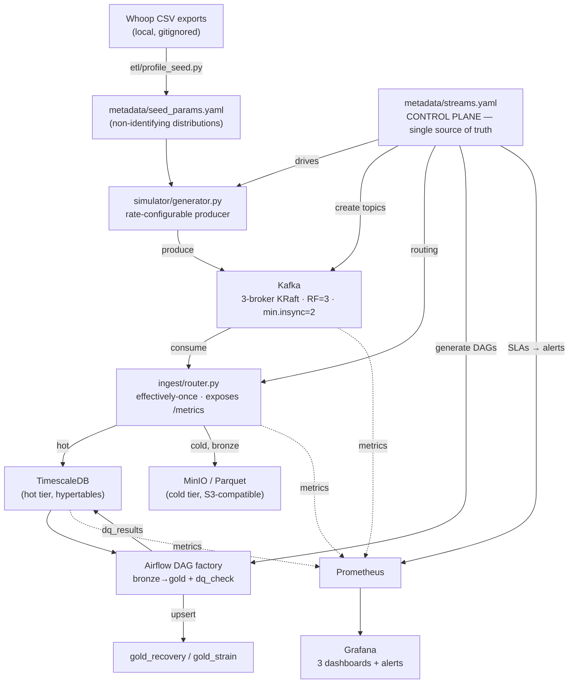

# Architecture

The visual companion to the [README](../README.md) and [runbook](runbook.md). It
shows the data flow, how the chosen services map to the assignment's service
categories, and where the four anomaly scenarios are injected.

---

## 1. Data flow

Two observability layers land on one Grafana ("single pane of glass"):
**infrastructure** (Kafka/TimescaleDB/host/router exporters) and **data quality**
(`dq_results` surfaced through postgres-exporter). The data layer is what catches
anomalies the infrastructure layer is blind to — see scenario ④.

---

## 2. Service categories (assignment mapping)

The assignment asks for one or more services across categories. This project
combines three into a single project-based scenario (Hybrid Storage + Messaging):

| Category | Service | Role here |
|---|---|---|
| **Messaging / streaming** | Kafka (3-broker KRaft) | Ingestion backbone; replay buffer (7-day retention) |
| **Object storage** | MinIO (S3-compatible) | Cold tier; Parquet bronze archive (source of truth) |
| **Relational database** | TimescaleDB (PostgreSQL) | Hot tier (hypertables) + derived gold metrics + `dq_results` |

Orchestration (Airflow LocalExecutor) and monitoring (Prometheus + Grafana +
exporters) are scaffolding for the scored core, not separate deliverables. See the
ADRs in [docs/adr/](adr/) for why each was chosen.

---

## 3. Multi-node / clustered topology

- **Kafka:** 3 brokers in a KRaft quorum (combined broker+controller), RF=3 and
  `min.insync.replicas=2`. Losing one broker keeps the cluster writable and
  re-elects a leader; losing two blocks writes (the availability boundary demoed
  in scenario ②). See [ADR-0004](adr/0004-kafka-kraft-topology.md).
- **Storage tiers:** hot (TimescaleDB, 30-day retention) and cold (MinIO, 90-day
  lifecycle) are physically separate services with independent durability.
- Compose profiles isolate concerns: `foundation` (default) · `airflow` ·
  `monitoring` · `pgbouncer`.

---

## 4. Fault-injection map (the scored core)

Four injection points map to the four runbook scenarios. The key diagnostic
discriminator is **throughput**: it separates a *load* problem (throughput up)
from a *downstream* problem (throughput flat).

| # | Inject (`make …`) | Where it hits | Detect on | Alert / signal |
|---|---|---|---|---|
| ① surge | `chaos-surge` | producer rate ↑ | Pipeline Flow: lag ↑ **and** throughput ↑ | `ConsumerLagHigh_*` |
| ② broker | `chaos-kill` | Kafka broker killed | Cluster Health: brokers 3→2, under-replicated ↑ | `KafkaBrokerDown`, `UnderReplicatedPartitions` |
| ③ backpressure | `chaos-choke` | TimescaleDB table lock | lag ↑ **while** throughput flat; commit rate ↓; flush p95 ↑ | `ConsumerLagHigh_*` + flush-latency panel |
| ④ DQ freshness | `chaos-stale` | HRV input silenced | infra **GREEN**, Data Stores DQ status FAIL, freshness lag > 0 | `DataFreshnessStale`, `DataQualityCheckFailing` |

Scenario ④ is the differentiator: every infrastructure metric stays green while
the data-quality layer alone catches that readiness scores stopped updating. Full
detect → diagnose → resolve playbooks for each are in the [runbook](runbook.md).
